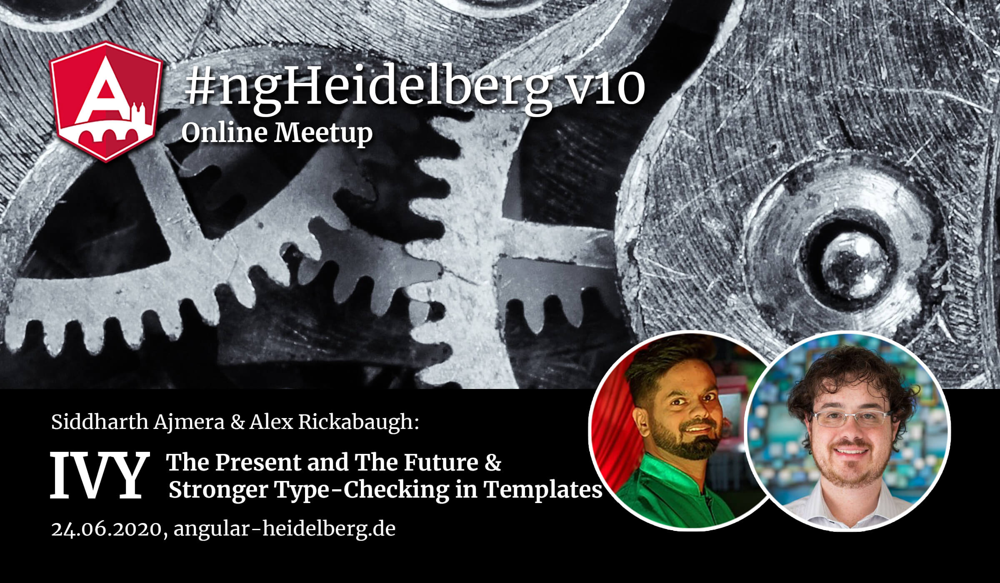

# Community updates, 2020-06-24

## 📅 Upcoming events

| 🏳️‍🌈 | Event | Location | Date | |
|------|------|-----|------|-----|
| 🇬🇧 | [RxJS Live](https://www.rxjs.live/) | London | 17th/18th September 2020 | **Community Partner ❤️** |
| 🇬🇧 | AngularConnect | London | 13th/14th October 2020 | |
| 🇺🇸 | NgRx Conf | Huntsville, Alabama | 5th/6th November 2020 | |
| 🇮🇱 | AngularUP | Tel Aviv | 10th December 2020 | |
| 🇮🇹 | ngRome | Rome | Postponed to Spring 2021 | |

## 🎥 Past events

### ng-conf: Hardwired
Videos from ng-conf 2020 online available on [YouTube](https://www.youtube.com/playlist?list=PLOETEcp3DkCqgRY9WsCBPMnOOWeFTCmnz)

### ngVikings
Videos available here: https://www.ngvikings.org/

## ℹ️ News

### Angular 10 RC 

- currently [`10.0.0-rc.6`](https://github.com/angular/angular/releases/tag/10.0.0-rc.6)
- 10.0.0 major release expected in end of June

### Speed up Angular CLI build times with distributed caching

- [Nx](https://nx.dev/) offers distributed caching of build tasks
- Now also available for "plain" Angular CLI: https://nx.app/angular-cli-faster
- Unlimited Coupon available for OSS projects (https://twitter.com/victorsavkin/status/1275104723524366340?s=20)

----

## Promo codes:

**Promo code:** `ngheidelberg` – with this promo-code, you'll get a 20% discount on the conference tickets.  

----

[Intro Slides](https://docs.google.com/presentation/d/1Go-TaZuGqOnPnuosteaIbwBeRmkDaRxTcGRjmOavFjs/edit?usp=sharing)

