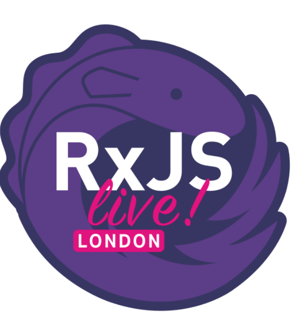

# Community updates, 2020-07-29

## 📅 Upcoming events

| 🏳️‍🌈 | Event | Location | Date | |
|------|------|-----|------|-----|
| 🎲 | [Angular Challenge 2020](https://editx.eu/it-challenge/angular-challenge-2020) | Online | From 15/06/2020 to 31/08/2020 | |
| 🇬🇧 | [RxJS Live](https://www.rxjs.live/) | London | 17th/18th September 2020 | **Community Partner ❤️** |
| 🇮🇹 | [ngRome](https://ngrome.io/) | Online | October 20th 2020 | |
| 🇬🇧 | [AngularConnect](https://angularconnect.com/) | London | 13th/14th October 2020 | |
| 🇺🇸 | [NgRx Conf](https://conf.ngrx.io/) | Huntsville, Alabama | 5th/6th November 2020 | |
| 🇮🇱 | [AngularUP](https://angular-up.com/) | Tel Aviv | 10th December 2020 | |

## ℹ️ News

### The State of Angular

There were some uncertainties and emotional statements __on social media__ about the Angular Core Team's work safety and health and the Angular framework itself. Stephen Fluin commented on these issues in ["The Angular Show E20"](https://open.spotify.com/episode/2zn7uTeNTHVjmGVsg5HDnb).

Summary: There was already a change in the management structure earlier this year. They are very concerned about the welfare of each employee and there will definitely be __a new roadmap very soon__. However, no one from the Angular team will comment on internal affairs or former employees and will not directly respond via social media.

### Angular 10 

There are very few new [features](https://blog.angular.io/version-10-of-angular-now-available-78960babd41) in this version, but many fixes.

### AngularJS LTS

The LTS phase of the legacy AngularJS framework was [extended for another 6 months](https://twitter.com/angular/status/1287780634572857357) due to COVID-19. However, now one should really, really migrate!

### More

* [Nx 10 was released](https://blog.nrwl.io/more-customizable-workspaces-angular-10-support-better-webstorm-jest-integration-and-more-in-nx-c9b2bd967166), many new features, including support for Angular 10
* Have a look: [RxAngular](https://github.com/BioPhoton/rx-angular), a toolset for handling fully reactive Angular applications, was introduced by Michael Hladky
* Nativescript is now owned by [nstudio](https://nstudio.io/)

----

<!--
## Promo codes:

**Promo code:** `ngheidelberg` – with this promo-code, you'll get a 20% discount on the conference tickets.  

-->

[Intro Slides](https://docs.google.com/presentation/d/1GtejS4ay-xtnxQaqBfH_2OP25LoqqBjFAHprnJKLWrQ/edit?usp=sharing)

