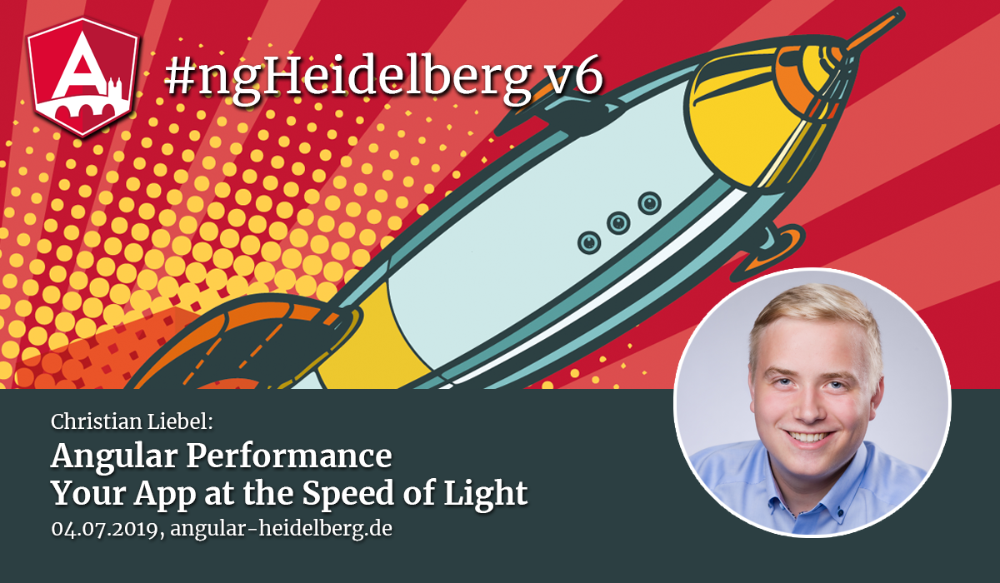
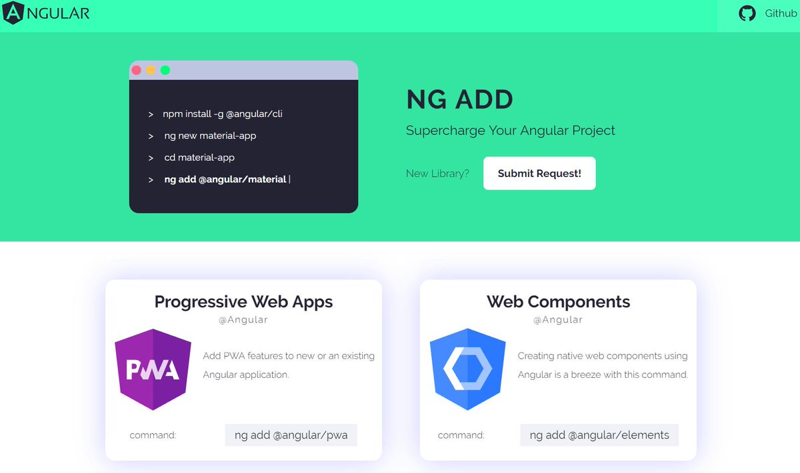

# Community updates, 2019-07-04

## Upcoming events:

1. 🇩🇪 NG-DE ❤️🤝, 30.-31. August 2019 in Berlin, see https://ng-de.org 
2. 🇮🇹 NgRome ❤️, 7. October 2019 in Rome, see https://ngrome.io
3. 🇪🇸 NgSpain ❤️, 19.-20. October 2019 in Madrid, see https://ngspain.com/
4. 🇺🇦 NgTalks ❤️ 🤝, 07.-08 November 2019 in Kharkov, see https://ngtalks.io/
5. 🇩🇪 Angular.Schule, 24.-27. September 2019 in Heidelberg, see https://angular.schule/heidelberg _(sponsored link)_

🤝 == we are Community Partners!

❤️ == with ngGirls free of charge workshop before!

----

## Next Meetup (#ngHeidelberg v7) – http://bit.ly/nghd7

Vote for a date:
* Please vote: **http://bit.ly/nghd7**
* August ?? – with Christian Janz
* Talk: Angular CDK – Toolbox for Angular

When developing enterprise applications with Angular, you need a rich set of UI components to make feature development fast and efficient. But what do you do if there are no suitable components for a particular application? This is where the Component Dev Kit (CDK) comes in: It facilitates the development of wizards, popups, drag-and-drop behavior and other components.

In this talk Christian gives an overview of the Angular CDK by first going into the history of the project and then classifying it into the known UI libraries. He will then introduce the various modules that the CDK contains and show the use of selected modules in live coding. 

----

## News:

1. 🚀 Angular 8 is out!
   * you can't have missed this news!
   * `ng update @angular/cli @angular/core` and you are ready to go
2. NgRx 8 is out (new leaner API `createAction(), createReducer(), createEffect()`)
   * `ng update @ngrx/store`
3. 2nd edition: the Angular-Buch (Malcher, Hoppe, Koppenhagen) is available, see https://angular-buch.com/ --> we will raffle one book today!
4. https://ngadd.com/ - a continuously updated list of all angular libraries that support `ng add` to save yourself a ton of time!
   

----

## Promo codes:

**NgTalks code:** `ngheidelberg` – with this promo-code, you'll get a 7% discount for conference tickets.  

&nbsp; &nbsp; 

**NG-DE code:** https://ti.to/ng-de/ng-de-2019/discount/community-angular-heidelberg – with this url, you'll get a 25% discount for conference tickets.  
