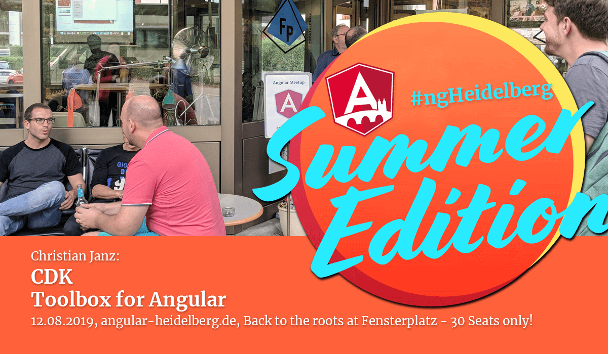
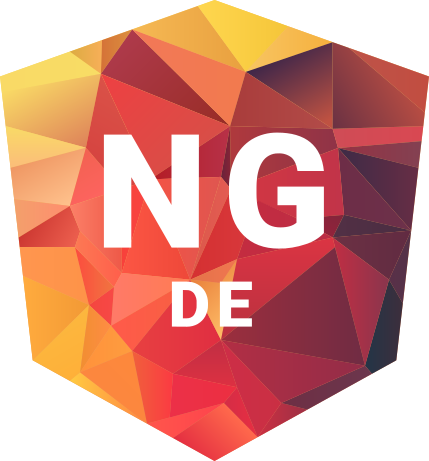

# Community updates, 2019-08-12

## Upcoming events:

1. 🇩🇪 NG-DE ❤️🤝, 30.-31. August 2019 in Berlin, see https://ng-de.org 
2. 🇮🇹 NgRome ❤️, 7. October 2019 in Rome, see https://ngrome.io
3. 🇪🇸 NgSpain ❤️, 19.-20. October 2019 in Madrid, see https://ngspain.com/
4. 🇺🇦 NgTalks ❤️ 🤝, 07.-08 November 2019 in Kharkov, see https://ngtalks.io/
5. 🇩🇪 __Angular.Schule, 24.-27. September 2019 in Heidelberg, see https://angular.schule/heidelberg _(sponsored link)___

🤝 == we are Community Partners!

❤️ == with ngGirls free of charge workshop before!

----

## Next Meetup (#ngHeidelberg v8)

Vote for a date:
* Please vote: TODO
* September ?? – with GDE Gregor Woiwode
* Talk: Jest, Boosting the Angular Testing Platform

----

## News:

1. TODO

----

## Promo codes:

**NgTalks code:** `ngheidelberg` – with this promo-code, you'll get a 7% discount for conference tickets.  

&nbsp; &nbsp; 

**NG-DE code:** https://ti.to/ng-de/ng-de-2019/discount/community-angular-heidelberg – with this url, you'll get a 25% discount for conference tickets.  
