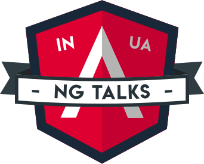

# Community updates, 2020-01-30

## Upcoming events:

1. ngAtlanta, February 2020, Atlanta/Georgia 
2. ng-india, February 2020, Delhi
3. RxJS Live, March 2020, London
4. IJS, April 2020, London
5. ng-conf, April 2020, Salt Lake City
6. ngVikings, May 2020, Oslo
7. AngularUP, June 2020, Tel Aviv
8. NG-DE, August 2020, Berlin
7. ngRome, October 2020, Rome
8. 🇩🇪 __Angular.Schule, 12.-15. May 2020 in Heidelberg, see https://angular.schule/heidelberg _(sponsored link)___

----

## Next Meetup (#ngHeidelberg v9)

Planned for March 2020.  

----

## News:

1. Scully.io - Angular Static Site Generator (JAMStack) has been a hot topic
----

## Promo codes:

**NgTalks code:** `ngheidelberg` – with this promo-code, you'll get a 7% discount for conference tickets.  

